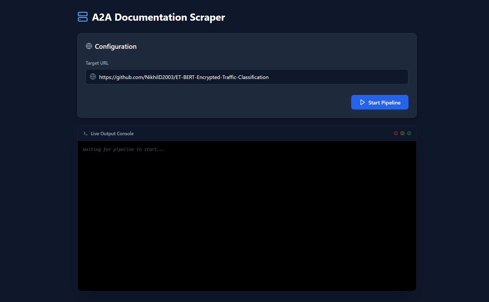

# 🕸️ A2A Autonomous Documentation Scraper

Welcome to the **A2A Documentation Scraper**, an enterprise-grade, fully autonomous Agent-to-Agent (A2A) web scraping pipeline designed to transform sprawling websites and complex GitHub repositories into clean, unified Markdown documentation, explore them via an interactive Knowledge Graph, and chat with them using an AI-powered RAG engine.

## 🛑 The Problem

When developers or AI researchers need to feed documentation into a RAG (Retrieval-Augmented Generation) system or simply read a project's manual offline, traditional web scrapers fail. They pull in massive amounts of noisy HTML—navigation bars, footers, redundant UI tabs, and binary files.

Conversely, asking an LLM to read a 50-page website and re-type it invariably leads to hallucinations, conversational filler, and severe output token limits. Massive repositories (like GitHub) also create a "Maze" of redundant links (commit hashes, raw files, blame views) that trap standard crawlers in infinite loops.

## 💡 The Solution & Core Features

This project introduces a robust A2A architecture where the Large Language Model acts as the *Manager*, not the *Typist*.

* 🎯 **Strict Path-Scoping:** Automatically traps the scraper inside the specified repository or subfolder. If you target `github.com/user/repo`, it will never accidentally wander into `github.com/pricing`.

* 🛡️ **The "GitHub Maze" Resolver:** Intelligently ignores commit hashes, repetitive UI tabs (`/issues`, `/pulls`), and large binary/data files (`.npy`, `.exe`, `.pdf`), ensuring only live, relevant code and documentation are processed.

* 🕸️ **Graph Database Mapping:** Uses **Neo4j** to map the website's structure as nodes and edges. This prevents duplicate content indexing and keeps track of how pages reference each other.

* 🚀 **Zero Token-Limit Failures:** Instead of forcing the AI to output massive blocks of compiled text, the Python backend securely hands off the pristine Markdown directly to system memory.

* ⚡ **Real-Time WebSocket UI:** A sleek React dashboard streams live terminal progress. Once compiled, it triggers a Blob-based Markdown download in the browser when the backend sends a `download` payload.

* 🧠 **Interactive RAG Chat:** Talk directly to your scraped documentation using OpenRouter (Nemotron 120B). It uses graph-aware keyword extraction and dynamic Cypher scoring with strict anti-hallucination guardrails.

* 📊 **Visual Knowledge Graph:** Automatically generates an interactive, top-to-bottom directory tree using ReactFlow and Dagre to visualize the hierarchy of the scraped documentation.

## 🌐 Live Demo & Deployment

The application is deployment-ready. If hosted, set `VITE_API_URL` in the frontend to your backend base URL.

🚀 Live App: https://a2-a-doc-scraper.vercel.app

System Dashboard Preview

Architecture showing the real-time WebSocket connection between the React Frontend and the FastAPI Backend.



## 🏗️ System Architecture

The project is split into a decoupled Client-Server architecture:

1. **The Client (React):** Connects to the server via WebSockets (`/ws`), sends the target URL, streams logs, and downloads the final Markdown via a Blob payload.

2. **The Server (FastAPI):** Initializes the AI Agent (via Google GenAI/ADK), exposes `/api/chat` and `/api/graph`, and orchestrates the pipeline.

3. **The Tools (Python/BeautifulSoup):** The agent triggers asynchronous scraping tools that traverse the web, clean HTML, convert it to Markdown, de-duplicate content, and filter noisy links.

4. **The Database (Neo4j):** Scraped content and relational links are `MERGE`d into the graph database to maintain state and prevent duplicates, with virtual directory nodes built for graph visualization.

5. **The Handoff:** The tools compile the graph data into a master Markdown string, store it in backend memory (`state.final_markdown`), and send the payload back over the WebSocket to the React client.

6. **The AI Chat Engine:** Uses a multi-stage RAG pipeline (Graph summary loading -> Keyword extraction -> Dynamic Cypher scoring -> Answer generation).

## 📂 Project Anatomy (File Structure)

Here is a breakdown of the core files that make this pipeline work:

### Backend (Python)

* `api.py`: The FastAPI server. It handles CORS, opens the WebSocket endpoint (`/ws`) with keep-alive pings, initializes the ADK agent runner, hosts the graph/chat API endpoints, and packages the final Markdown into a JSON payload for download.

* `remote_a2a/fastapi_scraper/tools.py`: The workhorse of the scraper. It contains the async `aiohttp` crawler, the `BeautifulSoup` HTML cleaner (with de-noising and de-duplication), strict URL scoping, GitHub filters, and the Markdown compiler that writes to `state.final_markdown`.

* `database/graph_manager.py`: The Neo4j database connector. It securely loads `.env` credentials and executes optimized Cypher queries (`upsert_topic`, `link_topics_batch`, `get_graph_data`, `get_graph_summary`) to map the website into a graph.

* `remote_a2a/fastapi_scraper/agent.py`: *(Internal)* Configures the ADK agent, reroutes OpenAI calls to OpenRouter, and binds the `run_full_pipeline` tool to the Nemotron model.

* `main_client.py`: Local CLI runner that executes the pipeline and saves the generated Markdown to `generated_docs/<site>.md`.

* `requirements.txt`: Contains all necessary Python dependencies (`fastapi`, `neo4j`, `beautifulsoup4`, `google-adk`, `google-genai`, etc.) for deployment.

### Frontend (React)

* `frontend/src/App.jsx`: The main user interface. It features a modern, dark-mode multi-tab UI built with Tailwind CSS and Lucide icons. It manages the WebSocket connection, auto-scrolls live logs, renders the ReactFlow graph with Dagre auto-layout, hosts the chat interface, and uses Blob downloads for Markdown delivery. It reads `VITE_API_URL` for the backend base URL.

## 💻 Tech Stack

* **Frontend:** React, Vite, Tailwind CSS, Lucide React, ReactFlow, Dagre, React Markdown, Remark GFM

* **Backend:** FastAPI, Python, WebSockets, Uvicorn, aiohttp, AsyncOpenAI (OpenRouter)

* **Database:** Neo4j (AuraDB Cloud / Desktop)

* **Data Processing:** BeautifulSoup4, Markdownify

* **AI Orchestration:** Google GenAI, ADK, LiteLLM, OpenRouter (Nemotron 120B)

## 🚀 Getting Started (Local Development)

### 1. Prerequisites

* Python 3.10+

* Node.js & npm

* A local Neo4j Desktop instance OR a free Neo4j AuraDB cloud account.

### 2. Backend Setup

Clone the repository

```bash
git clone [https://github.com/NikhilD2003/A2A-Doc-Scraper.git](https://github.com/NikhilD2003/A2A-Doc-Scraper.git)
cd A2A-Doc-Scraper
```

Install dependencies

```bash
pip install -r requirements.txt
```

Create a `.env` file in the root directory and add your credentials:

```env
NEO4J_URI=bolt://localhost:7687  # (or your AuraDB URI)
NEO4J_USER=neo4j  # (or NEO4J_USERNAME)
NEO4J_PASSWORD=your_password
OPENROUTER_API_KEY=your_openrouter_key
```

Start the FastAPI server

```bash
uvicorn api:app --reload --port 8000
```

### 3. Frontend Setup

Navigate to your React frontend directory (Vite-based UI)

```bash
cd frontend
npm install
npm run dev
```

### 4. Usage

Open the React frontend in your browser, enter a target URL (e.g., a GitHub repository path), and click **Start Pipeline**. Watch the terminal stream live actions. Switch to the **Knowledge Graph** to explore the site structure, or use the **Chat with Docs** tab to query your scraped data. For a no-UI run, execute `python main_client.py` to write the output to `generated_docs/`.
